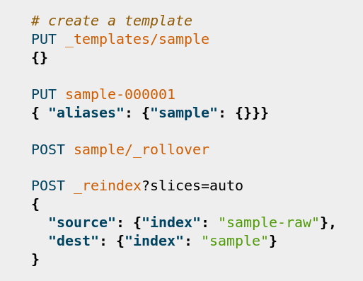

# Pygments Kibana

Custome lexer for [Pygments](http://pygments.org/) for the input of [Kibana](https://www.elastic.co/products/kibana)'s [Console app](https://www.elastic.co/guide/en/kibana/current/console-kibana.html).

## Install

```
pip install pygments-kibana
```

The lexer can then be used under the name `kibana`, for example in [reStructuredText](docutils.sourceforge.net/rst.html):

```
.. code:: kibana

	# create a template
	PUT _templates/sample  
	{}                       
				
	PUT sample-000001
	{ "aliases": {"sample": {}}}
																	
	POST sample/_rollover
													
	POST _reindex?slices=auto
	{                            
		"source": {"index": "sample-raw"},
		"dest": {"index": "sample"}           
	}        
```

will render as:


